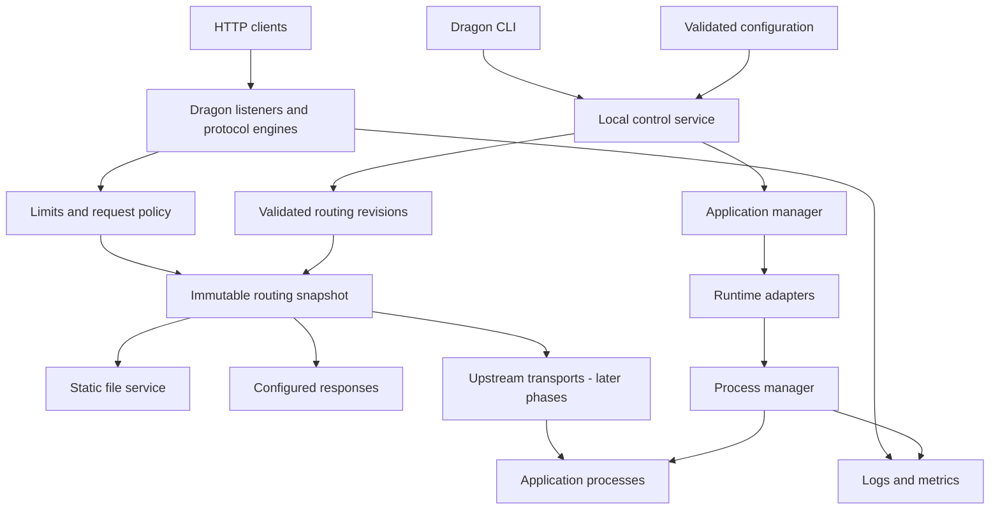

# Dragon Server Architecture Specification

Status: Architecture draft; Phase 1 implementation authorized and in progress.

Interfaces, configuration fields, commands, defaults, and layouts below describe the broader design. Only the subset documented in the repository README and PROGRESS.md is currently implemented and tested. Approval authorizes Phase 1 only, not the entire roadmap.

## 1. Vision

Dragon Server is an independent, Indian-built HTTP and application server: a server, runtime manager, application manager, networking layer, and deployment platform in one coherent product.

Dragon owns its connection policy, routing, static serving, application supervision, configuration, and deployment orchestration. It does not generate configuration for Apache or Nginx as its implementation. Mature networking, protocol, and security libraries remain legitimate building blocks; dependency reuse does not imply ownership of those libraries or invention of their protocols.

Niral is an important full-stack workload, supported through the same contracts as other applications. Its language, build system, services, and storage requirements must be inspected before integration. Dragon has no dependency on Szyora Server Engine and is not an LLM inference engine.

The intended differentiation is operational: one inspectable application lifecycle, readiness-gated traffic activation, bounded recovery, and consistent diagnostics across languages. These are design goals, not claims of unique invention, benchmark superiority, or being India's first server.

## 2. Goals and Non-goals

### Goals

- Serve static content and HTTP applications directly on infrastructure controlled by the operator.
- Support languages through explicit runtime and transport contracts without language branches in the request path.
- Make process ownership, resource use, failures, configuration revisions, and deployment outcomes observable.
- Bound work and memory under overload; preserve correct protocol behavior before optimizing throughput.
- Target Linux production first, macOS development next, and Windows through explicit platform implementations.
- Extend incrementally from one local server to distributed application management.

### Non-goals

- Reimplement TLS, cryptography, language interpreters, compilers, databases, or operating systems.
- Embed arbitrary application code into the server process or translate application languages.
- Promise that every existing application works unchanged. Supported execution and serving contracts determine compatibility.
- Replace Java servlet semantics, WSGI/ASGI, PHP execution, or application frameworks with a universal runtime.
- Offer hostile multi-tenant hosting before enforceable isolation has passed its security gate.
- Implement clustering, a dashboard, runtime downloads, or application deployment in Phase 1.
- Guarantee zero downtime, automatic database rollback, or exactly-once application side effects.

## 3. System Architecture

Two logical planes share versioned types but have different responsibilities. They need not be separate operating-system processes initially.



The data plane handles connections and requests. It reads an immutable routing generation and must not call runtime detection, builds, control-plane storage, or process creation for each request. An upstream becoming unavailable yields a bounded error, not a synchronous build or restart.

The local control plane validates desired state, serializes mutations per application, and reconciles observed processes. Readiness produces eligible endpoints; the application manager publishes those endpoints to the router. Requests pin their routing generation until completion. Old generations are retained only while needed, with bounded deployment concurrency and drain deadlines.

Architectural hypothesis: a new HTTP-speaking language adapter can be added without changing the network or routing modules. The Phase 2 discriminating test is a synthetic executable adapter plus a second fixture using the same endpoint contract. A language-specific branch in the router fails this boundary test. FastCGI is a new transport capability, not a PHP-specific router exception.

## 4. Component Architecture

These are ownership boundaries, not a requirement to create one crate or service per row.

| Component | Owns | Must not own | First phase |
| --- | --- | --- | --- |
| Core types | IDs, errors, cancellation, shared contracts | Global mutable service registry | 1 |
| Network | Listener lifecycle, admission, connection tracking | Runtime selection | 1 |
| HTTP | Protocol integration, routing, responses, static files | Application builds | 1 |
| Configuration | Parsing, validation, capability checks, revisions | Executing config as scripts | 1 |
| Observability | Structured events, bounded sinks, later metrics | Unbounded queues or secret dumps | 1 |
| CLI | Arguments, diagnostics, later control client | A second lifecycle implementation | 1 |
| Process manager | Spawn, process identity, exit, signals, output capture | Language detection | 2 |
| Runtime manager and adapters | Runtime resolution, build and launch plans | Routing decisions or independent supervisors | 2 |
| Application manager | Desired state, readiness, restart policy | Direct protocol parsing | 2 |
| Security/platform | Credentials, safe filesystem operations, OS enforcement | Treating policy declarations as enforcement | 1; expands in 4 |
| Upstream transports | HTTP and later FastCGI forwarding | Arbitrary URLs supplied by clients | 4 |
| Deployment | Release transactions, activation, rollback, retention | Reversing database changes automatically | 4 |
| Distributed control | Placement, leases, discovery, reconciliation | Request-by-request central coordination | 5 |

Dependency direction: CLI composes services; managers depend on contracts and platform services; HTTP consumes route and endpoint snapshots. Shared types do not import concrete adapters. Security is enforced at every applicable boundary, not deferred wholesale to Phase 4.

## 5. Runtime Adapter Architecture

An adapter describes how to prepare and run a workload. The process manager alone creates and owns processes. Adapter lifecycle methods delegate to that manager using scoped handles; they must not spawn an untracked private process tree.

The proposed public vocabulary remains `detect`, `build`, `start`, `stop`, `restart`, `health_check`, and `get_logs`. Internally, build and launch plans separate language knowledge from process execution. Restart policy belongs to the application manager, not each adapter.

| Workload | Preparation | Serving contract and limitation |
| --- | --- | --- |
| Node.js / JavaScript | Resolve an approved Node installation; explicit dependency/build steps | Long-running HTTP process on an assigned local endpoint |
| TypeScript | Explicit build tool or supported runtime selected by the application | No assumption that Node executes every TypeScript project directly |
| Python | Resolve the application's existing environment; explicit dependency steps | WSGI/ASGI server or another HTTP process supplied by the workload; Dragon does not embed Python |
| Rust / Go | Compile for a declared target or accept a compatible artifact | Execute a native binary; no compiler needed on the serving node for prebuilt releases |
| Java | Resolve JRE/JDK and explicit artifact/build steps | Executable HTTP application; WAR requires a compatible servlet container, not a raw `java` command |
| PHP | Resolve PHP and process-pool configuration | PHP-FPM over FastCGI for production; built-in development server is not a production substitute |
| C/C++ | Explicit toolchain and build description or prebuilt artifact | Native HTTP process; arbitrary libraries do not become web applications automatically |
| Niral | Determine from its real source and runtime contract | Use existing adapters where sufficient; add an adapter only for an actual distinct contract |

Static artifacts have no runtime process. Background workers have lifecycle and health contracts but no public HTTP endpoint. One application may contain several named services and static mounts; service dependencies must form a DAG. External databases and queues are declared dependencies, not implicitly installed or managed.

Detection is read-only and returns evidence and ambiguity. It never runs repository scripts, downloads runtimes, or chooses among conflicting manifests silently. Explicit runtime configuration takes precedence.

Initial runtime resolution uses existing operator-approved installations. Later installation requires verified distribution metadata, platform/architecture matching, digest/signature verification where supplied, safe archive extraction, and atomic versioned installation. Never overwrite an in-use runtime or remove one referenced by a retained release. No hidden network installation during `start`.

## 6. Process Model

Phase 1 has one foreground Dragon process with a bounded asynchronous executor. There is no process per connection, daemonization, prefork worker architecture, or privileged master. Blocking filesystem work uses a separately bounded pool. A process-wide crash affects all its connections; this limitation is explicit.

Phase 2 adds a local supervisor and separate application processes. Each service instance is identified by application ID, release ID, instance ID, and process generation, not PID alone. Every child is reaped; output is drained concurrently to avoid pipe deadlocks. Build subprocesses use the same ownership and timeout discipline.

On Unix, process groups help deliver shutdown signals. They are not a security boundary, and a descendant can escape a group. Phase 4 Linux containment uses dedicated service identities and cgroups, including descendant tracking. Windows requires Job Objects and service-control semantics; macOS cannot silently claim Linux cgroup guarantees.

For stop: remove readiness and traffic eligibility, drain where supported, send graceful termination, wait to a deadline, force termination of the owned group or containment unit, reap, then release ports and resources. Cancellation of a spawn/build request must still complete cleanup.

Restart defaults proposed for managed services: exponential delay starting at 1 second, capped at 30 seconds with jitter, at most five attempts in five minutes. Ten minutes of stable readiness resets the budget. Exhaustion enters `failed` until an explicit operator action. Planned stops and completed one-shot jobs do not trigger restart loops.

An OS service manager may restart Dragon itself; this is not delegated application orchestration. Phase 2 must document that supervisor failure may interrupt workloads. Phase 4 requires a Linux recovery policy that verifies owned cgroups/process identities, cleans residual instances, and reconciles durable desired state. Never signal or adopt a process solely because a saved PID matches.

## 7. Networking Architecture

### Protocol and Routing Policy

Phase 1 implements an HTTP/1.1 server using Hyper's parser and framing engine over Tokio TCP. TCP reads are not request boundaries. Partial headers, chunked bodies, persistent connections, EOF, and cancellation are protocol test cases, not custom string-splitting logic.

Routing selects a configured host, then an exact path before the longest segment-boundary prefix, then a method-specific action. Equal-precedence conflicts are configuration errors. Paths are case-sensitive; hosts are normalized ASCII domain names or IP literals with validated ports. Unknown hosts are rejected unless an explicit catch-all site exists. Missing or invalid required authority is a bad request.

Phase 1 accepts origin-form request targets; handle `OPTIONS *` explicitly. It is not a forward proxy: absolute-form and CONNECT targets are rejected. TRACE is disabled. Phase 4 adds authority validation for HTTP/2 and SNI/host policy for HTTPS.

Reject malformed percent encodings, NUL, backslashes, encoded path separators, and dot segments rather than ambiguously normalizing them. Decode individual segments exactly once for matching and static lookup. Query strings do not participate in path matching. No implicit trailing-slash redirects or SPA fallback. Later proxying preserves the original accepted path/query unless a route explicitly defines a rewrite.

Unknown paths return 404; a matched path with an unsupported method returns 405 with `Allow`. HEAD returns GET-equivalent headers without a body. Response framing remains the HTTP engine's responsibility. Reject ambiguous message framing and close the connection rather than reusing it with unread ambiguous data; verify library behavior with raw-wire tests.

### Admission and Backpressure

Proposed Phase 1 defaults, subject to measurement: 1,024 open connections, 256 active requests, 100 headers, 16 KiB total request head, 8 KiB request target, and 1 MiB request body. Counts and byte limits are separate and positive. Admission permits are acquired before spawning tracked work; there is no unbounded waiting-task queue.

Proposed timeouts: 10 seconds for the request head, 30 seconds for body completion, 30 seconds for response completion, 15 seconds idle keep-alive, and 10 seconds shutdown drain. Rejected bodies are drained only within bounded size/time or the connection is closed. Slow readers must not retain file handles and tasks indefinitely. Later streaming routes explicitly replace total deadlines with bounded idle/progress policies.

Overload at request admission returns 503 when a valid request can be answered; connection admission may close the socket before HTTP parsing. Limits produce 413, 414, or 431 where safely identifiable; timeouts produce 408 when possible, otherwise closure. Internal details are logged, not returned to clients.

### Static Files

Serve GET/HEAD only beneath an explicit document root, with known MIME types and `application/octet-stream` fallback. Directory listings, dotfiles, symlinks, and device files are denied by default. A directory may resolve an explicitly configured index filename; otherwise return 404. Do not execute files or automatically expose an application's source directory.

Use descriptor-relative, beneath-root opens with no-follow semantics, or an equivalent reviewed capability-based filesystem library. A canonicalize-then-open string check alone is vulnerable to symlink races. Phase 1 must either pass containment tests on a platform or refuse unsupported static serving there. Static roots must not be writable by untrusted users. Stream fixed-size chunks with bounded concurrent reads; sendfile is a later profiling-driven optimization. Range and conditional-cache support are deferred; unsupported Range requests may receive the complete 200 representation without advertising range support.

### Later Transports

Phase 4 adds TLS 1.2/1.3, ALPN HTTP/2, HTTP reverse proxying, WebSocket upgrade forwarding, and PHP FastCGI. HTTP/2 needs stream, header-table, flow-control, reset-rate, and connection budgets. HTTP/3/QUIC is future work requiring a separate library and protocol gate, not a Hyper configuration switch assumed to work today.

Proxying strips hop-by-hop headers, including names nominated by `Connection`, and reconstructs framing through the transport library. Preserve repeated end-to-end fields such as `Set-Cookie`. Preserve compressed bytes and matching `Content-Encoding`; if a deliberate transformation changes bytes, update encoding, length, and validators together. Disable implicit decompression and redirect following in the upstream client. Test request smuggling and header/body consistency across both sides.

Trust forwarded client information only from explicitly configured proxy ranges; otherwise replace spoofable forwarding headers. Upstream destinations come from validated operator configuration, never request-supplied URLs. Egress and DNS policies must guard access to control endpoints and metadata services. Upstream pools have bounded connections, queues, connect/response deadlines, and cancellation propagation. Retries default off; enabling them requires method safety, a replayable body, a total budget, and no response already committed downstream.

## 8. Application Lifecycle

Desired state and observed state are separate. `running` means a process exists; `ready` means its configured serving contract has passed readiness. Process existence alone never qualifies an HTTP backend for traffic.

```text
registered -> validated -> preparing -> prepared -> starting -> ready
ready -> unhealthy -> recovering -> starting
ready -> draining -> stopping -> stopped
preparing | starting | recovering -> failed
failed -> preparing | starting     (explicit authorized retry)
```

Validation has no execution side effects. Preparation produces immutable release artifacts. Start reserves resources and creates an instance. Readiness has an overall startup deadline plus bounded probe attempts. Liveness and readiness have separate thresholds: readiness removes traffic; liveness may request a bounded restart. External dependency outages should not automatically restart otherwise healthy services.

Each mutation carries an operation ID and expected application revision. Operations for one application serialize; conflicting revisions return a conflict. Retrying the same operation ID with the same payload returns the existing operation. A different payload with that ID is rejected. Stop cancels an in-flight start and its owned subprocesses.

In Phase 2, readiness and lifecycle are validated through the private endpoint; public application forwarding is not yet supported. Phase 3 adds adapter compatibility on those endpoints. Phase 4 connects eligible instances to public traffic. This staging deliberately does not present Phase 2 as a complete hosting product.

## 9. Configuration Architecture

Recommend TOML for operator-authored configuration: explicit types and readable comments with less implicit scalar typing than YAML. JSON is suitable for machine APIs but less convenient for hand editing; YAML is familiar but brings additional parsing features and ambiguity. Choose one authoring format initially, not three competing parsers. Configuration is data, never executable code.

### Phase 1 Schema Proposal

```toml
schema_version = 1

[server]
listen = "127.0.0.1:8080"
shutdown_timeout_ms = 10000

[limits]
max_connections = 1024
max_in_flight_requests = 256
max_headers = 100
max_header_bytes = 16384
max_target_bytes = 8192
max_body_bytes = 1048576
header_timeout_ms = 10000
body_timeout_ms = 30000
response_timeout_ms = 30000
idle_timeout_ms = 15000

[logging]
level = "info"
format = "json"

[[sites]]
id = "local"
hosts = ["localhost", "127.0.0.1"]

[[sites.routes]]
path = "/hello"
match = "exact"
methods = ["GET", "HEAD"]
action = "respond"
status = 200
content_type = "application/json"
body = '{"message":"Hello from Dragon"}'

[[sites.routes]]
path = "/assets"
match = "prefix"
methods = ["GET", "HEAD"]
action = "static"
root = "./public"
index = "index.html"
```

The example port is a proposal, not a claim about a running service. `/assets/logo.png` maps to `logo.png` beneath the root. The root must exist before startup. `respond` and `static` are tagged unions: irrelevant or unknown action fields are rejected. Respond status codes are restricted to final responses with validated body semantics; configured headers cannot override transport framing. JSON bodies are validated when their configured content type is JSON.

Required fields: `schema_version`, `server.listen`, nonempty `sites`, unique site IDs, explicit hosts, and each route's selector and action. Omitted limit/log fields receive the documented defaults. Reject unknown fields, duplicate assignments, invalid addresses, empty host lists, conflicting hosts/routes, invalid numeric bounds, missing roots, and unsupported capabilities before binding a listener.

### Later Application Schema

| Field | Type and contract |
| --- | --- |
| `id` | Stable restricted identifier, not a filesystem path |
| `services` | Map of named service specifications; no implicit language inference |
| `runtime` | Adapter ID, runtime installation reference, version constraint |
| `build` | Optional ordered argument-vector commands, working directory, deadline |
| `start` | Executable, argument vector, working directory; no shell interpolation |
| `endpoint` | HTTP TCP, HTTP Unix socket, FastCGI, or none; capability-checked |
| `environment` | Explicit non-secret string map; cleared inherited environment by default |
| `secrets` | Named references to a protected provider, never inline secret values |
| `resources` | CPU millicores, memory bytes, process/file limits; enforcement required |
| `health` | Typed readiness/liveness probe and timing/threshold policy |
| `restart` | Never, on-failure, or always, with explicit bounded budget |
| `depends_on` | Named services and required state; reject cycles |
| `storage` | Explicit persistent mounts separate from immutable release content |

Schema version and supported capabilities are independent: a Phase 1 binary rejects application sections even if the schema version is recognized. Runtime resolution records the exact selected version and artifact digest in release metadata. Argument vectors use typed endpoint substitutions after parsing, never shell string concatenation. Legacy applications needing a fixed port declare it; conflicts fail rather than terminating unknown processes. Inherited listeners are used only when a runtime explicitly supports them.

Paths resolve relative to the configuration file, not the caller's working directory. In Phase 1, precedence is built-in defaults, then one explicit file; CLI selects the file but does not silently override its contents. Do not expand arbitrary environment variables or discover `.env` files implicitly.

Configuration changes require restart in Phase 1. Phase 4 reload validates a complete candidate, prepares required resources, and publishes one immutable revision. Failure leaves the previous revision active. Listener/identity changes requiring restart are reported explicitly; they must not be partially applied. Effective-config inspection redacts secrets and identifies the source revision.

## 10. CLI Architecture

Phase 1 implements `dragon start --config <path>`, `dragon --help`, and `dragon --version`. `start` remains foreground and exits nonzero on invalid configuration or bind failure. SIGINT/SIGTERM trigger bounded shutdown. No shell command below exists yet.

| Command family | Intended behavior | Phase |
| --- | --- | --- |
| `dragon init`, `dragon dev`, `dragon build` | Explicit project setup, development mode, supervised builds | 2 |
| `dragon start` | Start the server; later optional application selector | 1; extended in 2 |
| `dragon stop`, `dragon restart`, `dragon status`, `dragon logs` | Control owned instances and inspect lifecycle/output | 2 |
| `dragon app list`, `dragon app inspect <id>` | Desired/observed state, release, endpoint, failures | 2 |
| `dragon runtime list` | Discover approved installations and capabilities | 2 |
| `dragon runtime install <type>`, `dragon runtime remove <type>` | Explicit verified installation/removal, with version selection | 3 |
| `dragon deploy`, `dragon rollback` | Release transaction and readiness-gated activation | 4 |

Later control commands use a versioned local control socket, not PID-file signalling or a publicly bound admin port. CLI output defaults to readable text, with stable JSON output for automation. Streamed application logs are labeled and kept distinct from control responses.

Proposed exit classes: 0 success, 1 execution failure, 2 invalid invocation/configuration, 3 control service unavailable, 4 conflict, 5 authorization denied. Every failure includes a stable code, affected object, concise cause, and actionable remedy without secrets. Unsupported commands must not be advertised as working. Interactive confirmations are never silently answered in automation.

## 11. Security Architecture

Threats include malicious clients, compromised applications, untrusted build scripts, dangerous configuration, hostile plugins, stolen operator access, and compromised dependencies. Configuration/administration is trusted operator authority, but still strictly validated. Application source and build scripts are executable code, not passive input.

| Boundary | Required controls |
| --- | --- |
| Internet to data plane | Strict framing, timeouts, byte/concurrency budgets, TLS in production, no public management routes |
| URL to filesystem | Beneath-root descriptor access, no-follow policy, permissions, no secret/source exposure |
| CLI to management | Socket directory permissions, peer identity checks, scoped authorization and audit |
| Supervisor to workload | Explicit executable/environment, restricted handles, separate identities and resource enforcement |
| Workload to host/other apps | OS filesystem/network policy plus sandbox controls; separate storage and credentials |
| Build to serving node | Separate build identity/environment; no production secrets; artifact verification |
| Remote operator/node | Later mutual authentication, scoped authorization, rotation and revocation |
| Dependency to release | Locked dependencies, advisory/license review, provenance and reproducible release records |

Run unprivileged by default on a high port. Do not run application code as root. Later privileged port binding uses a narrowly scoped OS facility or reviewed helper rather than a permanently privileged general supervisor. Strong resource settings fail closed when the requested OS enforcement is unavailable.

Process separation isolates address spaces but is not a secure sandbox. Cgroups account for and limit resources but do not by themselves restrict filesystem access or network access. Linux namespaces, dedicated users, capability removal, no-new-privileges, syscall policy, mount policy, and egress policy must be combined and tested for the claimed isolation level. Containers share a kernel; VMs provide a separate guest-kernel boundary and may be needed for hostile workloads. Neither support is implied by launching a process.

Phases 1-3 are for trusted operators and workloads in controlled environments. Phase 4 initially targets trusted single-operator production hosting with enforced application limits. Untrusted multi-tenant hosting requires a separately reviewed isolation profile and adversarial tests; it is not automatically unlocked by Phase 4 completion.

Secrets are resolved only for the target workload, never inherited wholesale or returned by inspect/log APIs. Environment injection can expose secrets to privileged or same-identity local processes; prefer restricted file/descriptor delivery where supported. Build steps do not receive production secrets. Redaction reduces accidental disclosure but cannot prevent an application deliberately printing its own secret.

Logs omit authorization, cookies, bodies, and query values by default. Access events include request ID, route ID, status, byte counts, duration, protocol, and termination reason. Validate client-provided request IDs or generate new ones. Bound log records, queue size, retention, and metric label cardinality. Slow sinks may drop access/debug events with a visible counter; management audit records require durable recording or the mutation must fail. Disk-full behavior is tested.

## 12. Plugin Architecture

Phase 2 uses statically registered, first-party adapters. Do not stabilize a dynamic plugin ABI before two real adapters exercise the shared contract. No runtime-loaded native shared libraries in the initial server: they can corrupt the process and cannot be sandboxed by a Rust trait.

Later external adapters run out of process using a versioned, bounded, length-prefixed JSON protocol over a private pipe/socket. Negotiate protocol version and capabilities before execution. Requests carry an operation ID and deadline; malformed replies, oversized frames, hangs, or plugin crashes fail only the associated operation. Standard output is reserved for protocol frames, diagnostics for standard error.

A plugin returns declarative build/launch/probe plans. Only the supervisor executes approved actions after checking application scope and platform policy. Plugins receive scoped metadata, not the entire configuration or secret store, and cannot publish routes or signal arbitrary PIDs. Plugin installation is explicit and integrity-checked. An external process is still trusted unless an OS sandbox enforces its declared permissions.

Request-path extension hooks, WASM execution, and a public plugin marketplace are deferred. Version incompatibility is a clear refusal, not best-effort execution of unknown messages.

## 13. Deployment Architecture

Phase 4 uses immutable releases plus mutable, transactional deployment state. A release includes an application manifest, artifact digests, target platform, resolved runtime identity, configuration revision, and required capabilities. Persistent application data lives outside release directories.

Recommended local state store: SQLite transactions for operations, desired state, release references, and activation intent. It is control-plane storage, not a dependency of each HTTP request. The connection is owned by bounded control-plane work. Use a single active node controller and local filesystems with documented durability; do not share this store across nodes to simulate a cluster.

Deployment sequence:

1. Authorize and record an idempotent operation; reserve a per-application revision.
2. Validate and stage verified artifacts in a new release location. Reject archive traversal and escaping links.
3. Reserve resources for old and new instances concurrently. Fail without disturbing the old release if capacity is insufficient.
4. Start candidate instances on distinct local endpoints, then run readiness and compatibility checks.
5. Record activation intent durably; atomically publish the new routing generation; record activation acknowledgement.
6. Drain old requests and long-lived sessions to explicit deadlines, then stop old instances.
7. Retain the prior release for rollback; delete only unreferenced artifacts under retention policy.

Disk state and an in-memory route swap cannot be one atomic transaction. Recovery reconciles intent and acknowledged generation, revalidates candidate readiness, and either completes activation or keeps/restores the previous healthy generation. Never route to a recorded endpoint merely because it exists in storage. Inject crashes before and after each activation step to verify this contract.

Rollback selects a retained artifact and repeats readiness-gated activation. It does not reverse external writes, queues, or schema migrations. Applications must declare backward-compatible database/session behavior for overlapping releases. Long-lived WebSockets may be disconnected at the drain deadline; requests already committed to an old instance are not migrated. These constraints preclude an unconditional zero-downtime promise.

TLS certificate management supports explicit operator certificates first, then automated issuance/renewal through a reviewed ACME library. Check domain authorization, certificate/key match, renewal failure, expiry alerts, protected storage, and atomic certificate rotation. Never silently fall back to plaintext when TLS fails. DNS/domain ownership and load-balancer routing remain operator responsibilities unless explicitly integrated later.

Phase 5 introduces authenticated nodes, a durable authoritative control plane, fenced scheduling operations, service discovery, load balancing, placement based on declared resources/capabilities, and bounded autoscaling. Use a proven consensus/store implementation, not a homemade consensus protocol. Nodes continue last-known healthy serving configuration during control-plane loss but do not accept conflicting scheduling authority. Singleton jobs need fencing beyond leases; partitions cannot guarantee both unrestricted availability and exclusive ownership. A separate distributed design review is required.

## 14. Proposed Repository Structure

Do not create empty components to imply implementation. Phase 1 starts with one Rust package exposing a testable library and CLI binary; logical modules can become crates when actual dependency boundaries justify it.

```text
dragon/
    README.md
    PROGRESS.md
    Cargo.toml
    Cargo.lock
    rust-toolchain.toml
    src/
        main.rs
        lib.rs
        core.rs
        config.rs
        network.rs
        http/
            mod.rs
            router.rs
            response.rs
            static_files.rs
        platform/
            mod.rs
        logging.rs
        cli.rs
    tests/
        http_integration.rs
        config_validation.rs
        static_security.rs
        fixtures/
    examples/
        minimal/
    docs/
        architecture/
        getting-started/
        runtime/
        networking/
        deployment/
        security/
        configuration/
        cli/
        contributing/
```

Later modules: `process`, `runtime`, `app`, `security`, `monitor`, `deployment`, and `runtime-adapters/{node,python,rust,go,java,php}` with native C/C++ support through the executable contract. The original `dragon-*` names may become crates when warranted; they are not separate daemons by default. Only this specification and a progress record are being created in Phase 0.

## 15. Technology Choices with Justification

| Candidate | Strengths | Costs and risks | Decision |
| --- | --- | --- | --- |
| Rust | Memory safety in safe code, explicit ownership, no tracing GC, native binaries, strong async/protocol ecosystem | Async ownership complexity, compile times, platform APIs need care; unsafe dependencies still require review | Recommended for core and CLI |
| Go | Mature standard HTTP stack, straightforward concurrency and tooling, fast delivery | GC and allocation behavior need measurement; less direct memory-layout control | Strong alternative if delivery simplicity outweighs low-level control |
| C++ | Native performance, mature systems libraries, precise control | Greater memory-safety burden and difficult lifetime/concurrency auditing | Not recommended as default for an internet-facing new core |
| C / Zig | Low-level control and native integration | More manual safety/protocol integration work; narrower ecosystem in some areas | Consider only for justified platform interfaces, not initial core |

Rust does not automatically make Dragon faster or safe against logic errors, denial of service, or unsafe dependencies. The recommendation is architectural, pending toolchain checks, dependency review, and user approval. No versions are pinned in this document.

| Area | Recommended building block | Dragon's responsibility |
| --- | --- | --- |
| Async I/O | Tokio | Admission, cancellation, task tracking, bounded blocking work |
| HTTP/1.1 and HTTP/2 | Hyper and matching integration/body utilities | Routing, timeout/limit policy, static and upstream behavior |
| TLS, Phase 4 | Rustls with a supported reviewed crypto provider and Tokio integration | Certificate lifecycle, SNI, ALPN, policy and alerts |
| Config/serialization | Serde, maintained TOML parser, JSON serializer | Strict schema, semantic validation, redaction, revisions |
| CLI | Clap | Commands, exit codes, diagnostics and stable automation output |
| Logging | Tracing and a bounded structured sink | Event schema, privacy, retention and overload policy |
| Local durable state, Phase 4 | SQLite through a maintained Rust binding | Transactions, migrations, recovery, backups and single-writer coordination |
| Safe filesystem/platform | Reviewed descriptor/capability APIs | Cross-platform confinement semantics and adversarial tests |
| HTTP/3 and ACME | Evaluate maintained implementations when the phase begins | Compatibility, security and release gates; no dependency selected yet |

Use compatible maintained releases, minimum necessary features, a committed lockfile, declared Rust toolchain, license review, dependency advisories, and an SBOM for releases. Approving library use here is not approving an arbitrary web framework or wholesale server fork. Own application infrastructure while reusing established protocol machinery.

Primary references checked for capability boundaries: [Tokio](https://tokio.rs/), [Hyper](https://hyper.rs/), [Rustls](https://github.com/rustls/rustls), and [Go net/http](https://pkg.go.dev/net/http). They establish library scope, not Dragon performance. Check release-specific documentation again before implementation; repository default branches may describe unreleased APIs.

## 16. API and Interface Definitions

These are language-neutral contracts, not compilable Rust or a frozen external API. All asynchronous operations take a deadline and cancellation context and return typed errors. Identifiers are opaque validated values.

```text
RuntimeAdapter
  capabilities() -> CapabilitySet
  detect(project_metadata) -> DetectionResult
  build(build_context, process_service) -> ArtifactManifest
  start(launch_context, process_service) -> InstanceHandle
  stop(instance_handle, stop_policy, process_service) -> StopResult
  restart(instance_handle, launch_context, process_service) -> InstanceHandle
  health_check(instance_handle, probe_context) -> HealthResult
  get_logs(instance_handle, log_query, log_service) -> BoundedLogStream

ProcessService
  spawn(process_spec, ownership_scope) -> ProcessHandle
  terminate(process_handle, deadline) -> ExitStatus
  wait(process_handle) -> ExitStatus

ApplicationService
  apply(desired_spec, expected_revision, operation_id) -> OperationHandle
  inspect(application_id) -> ApplicationStatus
  stop(application_id, expected_revision, operation_id) -> OperationHandle

RoutePublisher
  prepare(validated_routes, eligible_endpoints) -> PreparedGeneration
  activate(prepared_generation, expected_generation) -> GenerationId
  drain(generation_id, deadline) -> DrainResult
```

`restart` is an adapter-facing convenience for an explicitly authorized restart, not permission to implement an independent recovery loop. Its default behavior delegates stop/start under the application manager's operation lock. `get_logs` queries the process-owned sink rather than reading arbitrary paths supplied by a plugin.

| Type | Minimum fields and invariants |
| --- | --- |
| `OperationContext` | Operation ID, application scope, deadline, cancellation token |
| `DetectionResult` | Candidate adapter, evidence, compatibility, ambiguity; no execution side effects |
| `ProcessSpec` | Resolved executable, argument vector, absolute cwd, allowlisted environment, secret references, stdio and resource policy |
| `ProcessHandle` | Opaque instance generation plus verified OS identity; never an untrusted raw PID |
| `ArtifactManifest` | Release ID, relative artifact paths, content digests, target platform, resolved runtime |
| `Endpoint` | Tagged HTTP TCP/Unix or FastCGI address tied to an owned instance; workers expose none |
| `HealthResult` | Ready/not-ready/unknown, timestamp, probe latency, sanitized reason |
| `ApplicationStatus` | Desired revision, observed state, release, owned instances, health, restart budget, active operation |
| `RouteAction` | Respond, static, or later upstream; cannot invoke runtime methods |
| `DragonError` | Stable code, safe message, object/operation IDs, retry classification; internal cause logged separately |

Local control transport in Phase 2: versioned, length-prefixed JSON requests over a permission-restricted Unix socket; Windows later uses an ACL-protected named pipe. Proposed maximum frame is 1 MiB and oversized frames close the channel before allocation. Peer credentials identify the caller; possession of a socket path alone is not authorization. Server-side authorization binds each operation to permitted applications. Protocol handshake rejects unknown major versions. No remotely exposed control API in the MVP.

## 17. Development Phases

| Phase | Deliverable | Exit gate |
| --- | --- | --- |
| 0 - Architecture | This specification, boundaries, risks and acceptance criteria | User reviews decisions below; no implementation before approval |
| 1 - Minimal server | Foreground CLI, TCP, HTTP/1.1, routing, static files, JSON responses, config, logs | Every Phase 1 test in sections 18 and 21 passes on declared targets |
| 2 - Application runtime | Generic adapter first, synthetic/native executable fixture, then Node; supervisor, lifecycle, health, logs, local control | Owned child cleanup, bounded restart, safe command arguments, private endpoint health, adapter-independence tests |
| 3 - Multi-language | Validate Node, then Python, Rust, Go, Java and PHP independently; C/C++ native fixture; explicit runtime inventory/install management | Per-adapter prepare/start/probe/stop/log tests and version/platform matrix; PHP probed through a test FastCGI client |
| 4 - Production hosting | HTTPS, HTTP/2, reverse proxy, FastCGI, WebSockets, graceful activation, metrics, enforced limits, isolation profile, recovery and rollback | Protocol/security tests, deployment crash injection, bounded overload, certificate rotation, Linux enforcement and soak tests |
| 5 - Distributed | Nodes, authenticated control plane, discovery, balancing, placement, distributed config and autoscaling | Separate architecture approval; partition, fencing, failover, capacity and reconciliation tests |

HTTP/3 remains separately gated future work. Niral integration follows inspection of its actual contract and the phases needed by that contract, not an assumed Node mapping. No major phase advances merely because command names exist.

### Decisions for Review

1. Approve Rust and the limited protocol/runtime-library approach, rather than a zero-dependency protocol implementation.
2. Approve TOML, one initial package, foreground execution, and Linux-first production scope.
3. Approve a trusted-workload development MVP; production TLS, public application forwarding, and enforceable isolation arrive in Phase 4.
4. Approve the Phase 1 acceptance boundary: no runtime adapters or deployment implementation yet.

Before implementation, verify the local toolchain and choose supported dependency versions. Before Niral integration, inspect its source with permission. Before publishing binaries, decide license/distribution policy and supported OS/architecture versions; this draft does not assign a project license.

## 18. Testing Strategy

Every implemented subsystem requires automated positive, negative, timeout, and cleanup coverage. Fixtures use temporary directories and allocated test ports; they must not depend on a developer's existing server, secrets, network downloads, or production data.

| Slice | Required tests |
| --- | --- |
| Phase 1 configuration | Example parses; defaults, unknown fields, invalid types, ambiguous hosts/routes, invalid paths/limits; invalid config binds no socket |
| Phase 1 routing/responses | GET/HEAD JSON and static content, exact/prefix precedence, segment boundaries, 404/405/Allow, OPTIONS, disabled methods, unknown/malformed host |
| Phase 1 raw networking | Fragmented request head/body, chunked body, keep-alive and pipelining order, invalid framing, conflicting lengths, premature EOF, slow client and disconnect |
| Phase 1 static security | Encoded traversal, double encoding, separators, symlink escape and swaps, dotfiles, special files, root permissions, bounded large-file streaming |
| Phase 1 lifecycle/logs | Bind conflict, signal drain and deadline, task/file-descriptor cleanup, bounded log sink, secret/header/query omission |
| Phase 1 resource behavior | Connection/request/head/body budgets under concurrent clients; no growth proportional to rejected waiting requests |
| Runtime/process | Missing executable, safe argv, large output, child/grandchild exit, ignored termination, spawn cancellation, crash-loop budget, stale identity, occupied endpoint |
| Adapter contracts | Detection ambiguity, existing Python environment preserved, artifact target mismatch, independent fake process service, language-neutral router |
| Production protocols | TLS/ALPN, certificate renewal failure, HTTP/2 limits, FastCGI framing, WebSocket half-close/drain, proxy encoding and hop-by-hop headers |
| Security/platform | Control authorization, cross-app resource access, egress denial, cgroup descendants, sandbox escape attempts, secret scope, malicious plugin replies |
| Deployment/recovery | Readiness failure leaves old release, concurrent operation conflict, crash at every activation boundary, rollback and storage retention |
| Distributed | Stale controller, partition, node restart, lost acknowledgement, lease expiry, fenced singleton, scheduling oversubscription |

Use unit tests for deterministic policy and integration tests against real sockets/processes. Fuzz request-target handling, config parsing/validation, control messages, and adapter responses. Exercise Dragon's integration around mature parsers, not only the parsers themselves. Use property tests for routing determinism and lifecycle invariants. Test malformed traffic on isolated local fixtures, never third-party services.

Implemented Rust gates are `cargo fmt --all -- --check`, `cargo clippy --locked --all-targets -- -D warnings`, and `cargo test --locked`. Formatting has been applied and Clippy/tests have passed locally on macOS; current results are recorded in PROGRESS.md. Linux CI is mandatory for a Linux serving claim; macOS tests cannot certify Linux enforcement. Add Windows to the support matrix only after its platform tests pass. Later nightly suites cover long soak, fuzzing, compatibility and dependency advisories.

## 19. Benchmarking Strategy

Measure correctness and resource ceilings before chasing peak throughput. Record hardware, kernel, architecture, compiler/profile, dependency versions, exact server config, application artifact, TLS settings, traffic generator/version, run duration, warmup, and raw output. Keep benchmark scripts and configuration alongside results when implemented.

Workloads: tiny configured response, realistic static assets, large streamed files, keep-alive and connection churn, slow readers/writers, concurrent uploads, proxied application traffic, TLS handshakes/reuse, and HTTP/2 multiplexing when supported. Application lifecycle benchmarks cover cold start, time-to-ready, crash recovery, deployment errors, drain duration, and rollback time.

Report successful requests/second, p50/p95/p99 latency, errors/timeouts, CPU utilization, resident memory, file descriptors, active tasks/connections, and bytes transferred. Separate Dragon resources from workload resources. Use a separate sufficiently provisioned load generator where practical; include open-loop tests to expose queueing and avoid coordinated-omission distortions. Repeat runs and report variability, not a single best number.

Compare Apache/Nginx only on equivalent features and workloads, with matching payloads, caching, logging, TLS, connection reuse, worker allocation, and resource budgets. Pin their versions/configs. Distinguish raw HTTP/static benchmarks from application orchestration workflows. Do not present a plaintext microbenchmark as proof of production superiority.

No absolute throughput or memory target is claimed yet. Establish a baseline on declared reference hardware, then agree regression budgets. Bounded queues, enforced deadlines, no growing descriptor/task leaks after repeated cycles, and correct responses are acceptance requirements regardless of throughput.

## 20. Major Technical Risks

| Risk | Mitigation and evidence needed |
| --- | --- |
| Scope expands into an entire hosting platform before HTTP works | Enforce phase gates; no speculative empty subsystems |
| Library defaults differ from security policy | Configure explicitly and test raw-wire behavior; reject unsupported strictness |
| Request smuggling or path interpretation mismatch | One documented decoding/framing policy; proxy differential and fuzz tests |
| Blocking work or unbounded tasks starve networking | Bounded pools/permits, cancellation tests, saturation profiling |
| Filesystem checks permit races | Descriptor-based confinement and adversarial link-swap tests |
| Application restart harms unrelated services | Scoped ownership, restart budgets, no raw-PID trust, enforced resource budgets |
| Runtime diversity breaks a uniform interface | Capability negotiation, typed endpoint transports, independently tested plans |
| Runtime installation creates supply-chain exposure | Explicit trusted sources, integrity verification, atomic installs, no silent updates |
| Supposed isolation is only a process group | Publish precise threat model and OS-enforced capabilities; refuse unavailable guarantees |
| Deployment loses state between disk and route activation | Durable intent/acknowledgement protocol plus crash-injection recovery tests |
| Database or session changes defeat rollback | Require compatibility declarations; no automatic data reversal |
| Two release generations exceed capacity | Reserve overlapping resources before launch; abort without stopping old release |
| TLS maintenance or dependencies fall behind advisories | Patch policy, release-specific API review, certificate expiry/rotation tests |
| Cross-platform claims outrun implementation | Publish per-platform capability matrix; Linux-first production evidence |
| Distributed partition causes duplicate authority | Mature coordination, fencing, explicit partition policy and separate design gate |
| Broad compatibility or performance claims exceed evidence | Publish tested versions/contracts and reproducible results with limitations |

## 21. MVP Definition

The immediate MVP is Phase 1, a minimal controlled-environment HTTP server, not the finished multi-language application platform. The first complete production-hosting milestone is Phase 4.

Phase 1 is accepted only when:

- One foreground `dragon start --config <path>` process validates configuration before opening its declared TCP listener.
- The example `/hello` route returns HTTP 200 with valid JSON; HEAD sends equivalent metadata without response bytes.
- Static assets stream from an explicitly configured safe root, with traversal and symlink containment tests passing.
- HTTP/1.1 framing, keep-alive, malformed requests, partial input, routing, and response/error behavior pass automated integration tests.
- Connection/request/byte/time limits are enforced, with bounded queues and cleanup under slow clients and disconnects.
- Structured logs expose request outcome and server lifecycle without default secret-bearing fields.
- Invalid configuration, permissions, and occupied ports yield actionable errors and nonzero exits.
- SIGINT/SIGTERM stop admission, drain eligible work to a deadline, and release tracked resources.
- Build, run, test, example configuration, supported targets, and limitations are documented from commands actually verified during implementation.
- Linux tests pass; macOS results are reported separately. No public production-readiness claim precedes TLS and the Phase 4 gate.

Excluded from Phase 1: HTTPS, HTTP/2/3, reverse proxy, WebSockets, application supervision, multi-language adapters, runtime installation, hot reload, managed deployment/rollback, metrics export, external plugins, clustering, and hostile workload isolation. These exclusions sequence delivery; they do not remove features from Dragon's roadmap.

Current checkpoint: architecture draft ready for review. No implementation, dependencies, benchmarks, or running server have been produced in Phase 0.